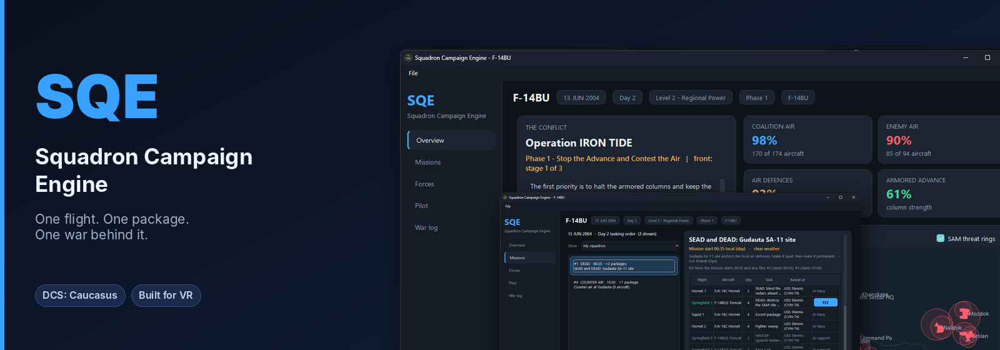
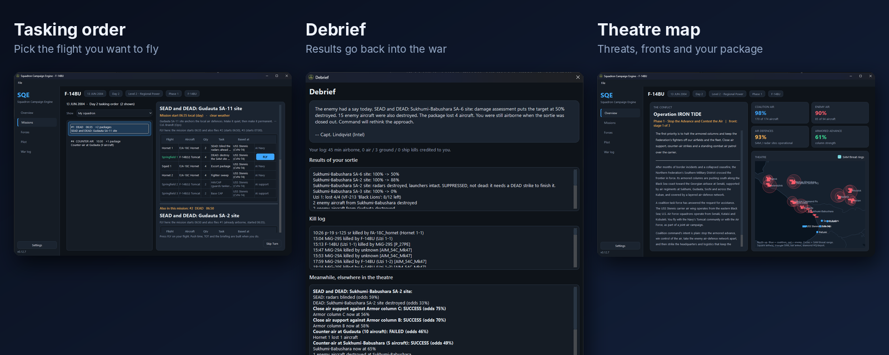
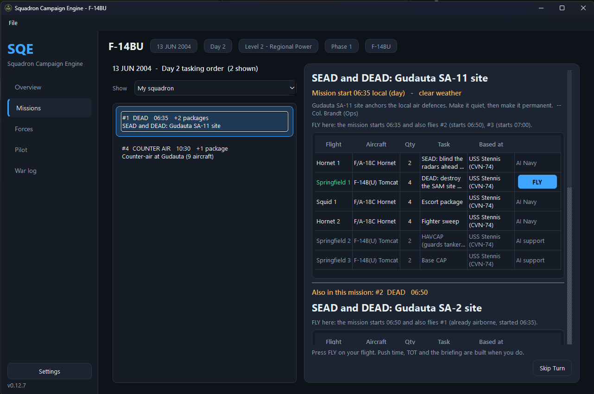
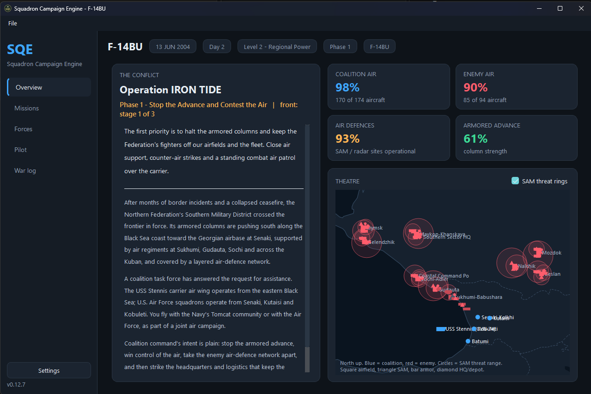
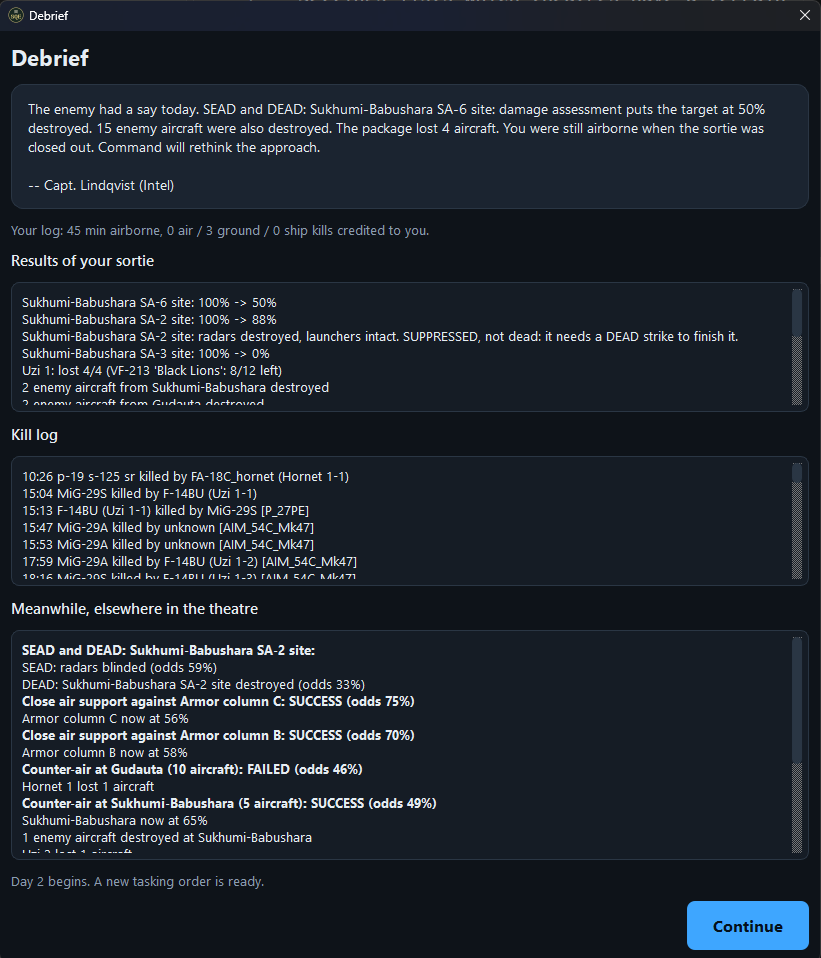
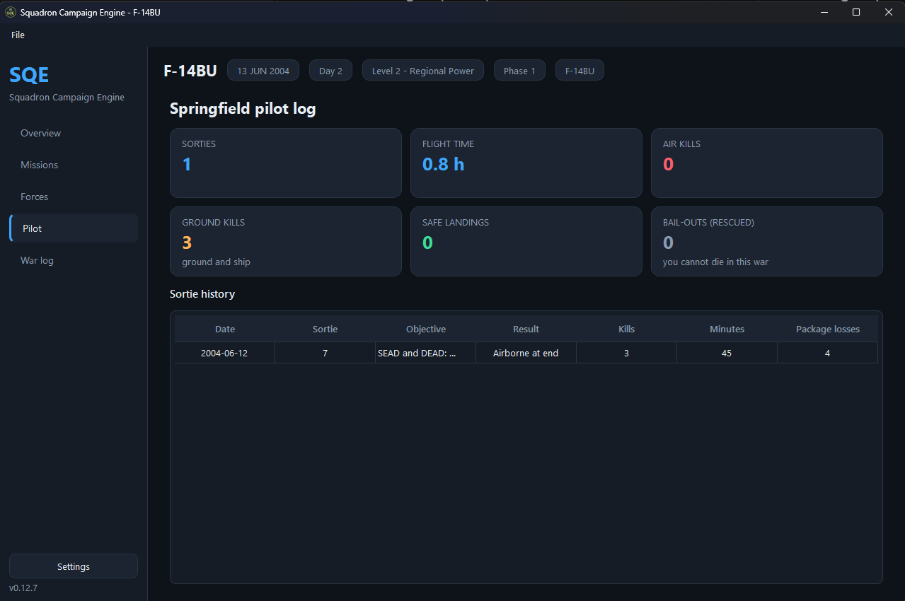
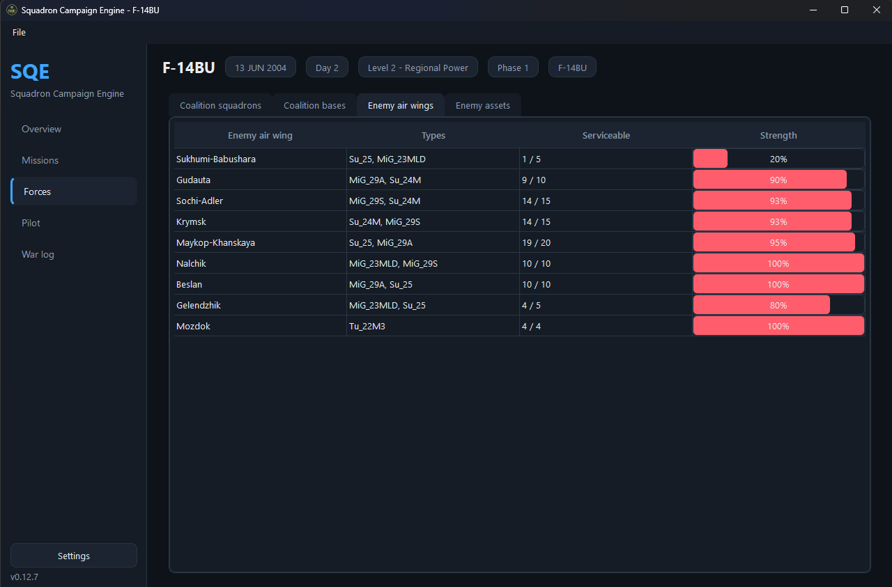
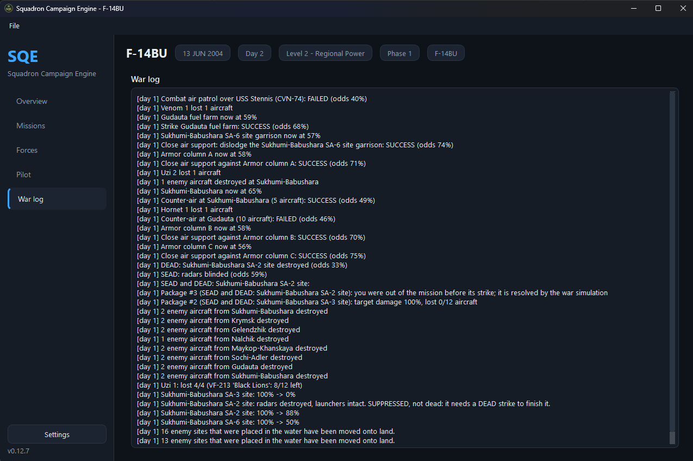

# Squadron Campaign Engine (SQE)

**A dynamic campaign for DCS World that gets out of your way.** An abstracted war runs in the background and issues a daily tasking order. You pick one flight; SQE builds a lightweight mission with only that package, its support and the enemy it will meet. Fly it, and the results go back into the war.

Low unit counts mean it runs smoothly in VR. The feel is Strike Fighters: you fly your sortie, the war goes on around you.

## What you get

* **A war that moves without you.** Airfields, SAM sites, armour columns and the fleet are simulated in the background; strikes, SEAD/DEAD, close air support and counter-air all change the picture.
* **One flight, one mission.** Choose from the day's tasking order; only that package and the relevant OpFor are built. Packages flying nearby can be folded in (merge radius, default 50 nm).
* **Proper packages.** BMS-style marshal/push/TOT timeline, escorts, SEAD, tankers, briefing and kneeboard.
* **Results that count.** A debrief hook reports kills and losses back through `SQE_state.json`; damaged sites stay damaged.
* **Sites that make sense.** Enemy sites are kept on land with an optional scan of your own DCS terrain.

## Screenshots

| | |
|---|---|
|  |  |
|  |  |
|  |  |

## Get started

Start here: **docs/GUIDE.md**   |   Sample briefing: docs/SAMPLE_BRIEFING.txt

    py -m venv .venv && .venv\Scripts\Activate.ps1
    pip install -r requirements.txt
    python tools/smoke_test.py      # headless self-test
    python -m sqe                   # the app

## Legal

* SQE is released under the **MIT licence** (`LICENSE`, copyright MarkuzJuniuz). It is **free of charge and non-commercial**, as DCS World's EULA requires of anything built on it. Debrief results need DCS's `MissionScripting.lua` opened up; SQE asks you on first run and does this **only if you agree** (default off, change it in Settings).
* It is **not made or supported by Eagle Dynamics SA**. It contains no DCS files; see `THIRD_PARTY_NOTICES.md` for the libraries it uses and their licences.
* **What the MissionScripting.lua option does**: DCS blocks `io` and `lfs` in mission scripts, which SQE needs to read your sortie results. With the setting on, SQE comments out
  those sanitizing lines in your own `MissionScripting.lua` when it starts (a backup is saved beside it) and restores the file when it closes. It changes nothing else. DCS updates and repairs can
  overwrite the file, which is why SQE re-applies the change at every start. If you play multiplayer, close SQE first so the file is unmodified.
* Use at your own risk; there is no warranty.

## Inspiration

Many of SQE's ideas are inspired by community campaign tools, especially DCS Liberation and DCS Retribution (a front line that moves as targets fall, packages with escorts and SEAD,
the MissionScripting approach for results, AI fuel management), and by the feel of the Strike Fighters series. SQE contains no code from them and is not affiliated with them.
